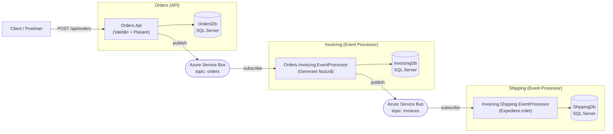

# Order Processing System - Proiect PSSC

## Descriere

Sistem software pentru preluarea de comenzi, facturare și expediere, implementat conform pattern-ului prezentat la laborator.

### Arhitectura

Proiectul conține **3 contexte independente**, fiecare cu baza sa de date:

1. **Orders** (API - vizibil utilizatorului)
   - Primește comenzi prin REST API
   - Face TOATE validările (sintactice + semantice)
   - Salvează comanda în baza de date doar dacă este validă
   - Trimite event către Invoicing prin Azure Service Bus

2. **Invoicing** (Event Processor - background)
   - Primește notificări (event) de la Orders
   - Generează factura și o "trimite pe email" (simulat prin log)
   - Salvează factura în propria bază de date
   - Trimite event către Shipping

3. **Shipping** (Event Processor - background)
   - Primește notificări (event) de la Invoicing
   - Pregătește coletul și îl predă curierului (simulat)
   - Salvează expedierea în propria bază de date

### Flow-ul complet



## Structura Proiectelor

### Context Orders
- `Orders.Api` - REST API (Swagger UI disponibil)
- `Orders.Domain` - Modele, Operații, Workflow, Repositories (interfețe)
- `Orders.Data` - DbContext, DTOs pentru DB, Implementări Repositories
- `Orders.Dto` - DTOs pentru comunicare între servicii
- `Orders.Events` - Interfețe pentru Event handling
- `Orders.Events.ServiceBus` - Implementare Azure Service Bus

### Context Invoicing
- `Orders.Invoicing.EventProcessor` - Aplicație consolă care ascultă pe message bus
- `Invoicing.Domain` - Modele, Operații, Workflow
- `Invoicing.Data` - DbContext, Repositories
- `Invoicing.Dto` - DTOs pentru event-uri
- `Invoicing.Events` / `Invoicing.Events.ServiceBus`

### Context Shipping
- `Invoicing.Shipping.EventProcessor` - Aplicație consolă
- `Shipping.Domain` - Modele, Operații, Workflow
- `Shipping.Data` - DbContext, Repositories
- `Shipping.Events` / `Shipping.Events.ServiceBus`

## Setup

### 1. Baze de date

Rulează scripturile SQL din folderul `SQL/`:

```sql
-- În SQL Server Management Studio sau Azure Data Studio
-- 1. create-orders-db.sql
-- 2. create-invoicing-db.sql  
-- 3. create-shipping-db.sql
```

### 2. Azure Service Bus

Creează în Azure Portal:
1. Un Service Bus Namespace
2. Două topicuri: `orders` și `invoices`
3. Subscripții:
   - Topic `orders` → Subscription `invoicing`
   - Topic `invoices` → Subscription `shipping`

### 3. Connection Strings

Actualizează `appsettings.json` în toate cele 3 aplicații:

**Orders.Api/appsettings.json:**
```json
{
  "ConnectionStrings": {
    "DefaultConnection": "Server=...;Database=OrdersDb;...",
    "ServiceBus": "Endpoint=sb://....servicebus.windows.net/;SharedAccessKeyName=...;SharedAccessKey=..."
  }
}
```

**Orders.Invoicing.EventProcessor/Properties/launchSettings.json:**
```json
{
   "ConnectionStrings:DefaultConnection": "Server=...;Database=InvoicingDb;...",
   "ConnectionStrings:ServiceBus": "..."
}
```

**Invoicing.Shipping.EventProcessor/Properties/launchSettings.json:**
```json
{
   "ConnectionStrings:DefaultConnection": "Server=...;Database=ShippingDb;...",
   "ConnectionStrings:ServiceBus": "..."
}
```

### 4. Rulare

Deschide 3 terminale și rulează:

```bash
# Terminal 1 - Orders API
cd Orders.Api
dotnet run

# Terminal 2 - Invoicing Event Processor
cd Orders.Invoicing.EventProcessor
dotnet run

# Terminal 3 - Shipping Event Processor
cd Invoicing.Shipping.EventProcessor
dotnet run
```

### 5. Testare

Accesează Swagger UI la: `https://localhost:7172/swagger`

Sau folosește Postman:

```http
POST https://localhost:7172/api/orders
Content-Type: application/json

{
  "clientEmail": "client@example.com",
  "shippingAddress": "Str. Exemplu nr. 123, Timisoara, Timis",
  "items": [
    {
      "productCode": "PRD-00001",
      "quantity": 2
    },
    {
      "productCode": "PRD-00002",
      "quantity": 5
    }
  ]
}
```

### Produse disponibile (prepopulate)

| Code | Nume | Preț |
|------|------|------|
| PRD-00001 | Laptop Gaming | 4500.00 RON |
| PRD-00002 | Mouse Wireless | 150.00 RON |
| PRD-00003 | Tastatura Mecanica | 350.00 RON |
| PRD-00004 | Monitor 27 inch | 1200.00 RON |
| PRD-00005 | Casti Gaming | 450.00 RON |

## Workflow-uri

### Orders Workflow
```
UnvalidatedOrder → ValidatedOrder → CalculatedOrder → PlacedOrder
                ↘ InvalidOrder (dacă validarea eșuează)
```

### Invoicing Workflow
```
UnprocessedInvoice → GeneratedInvoice → SentInvoice
                   ↘ FailedInvoice
```

### Shipping Workflow
```
UnprocessedShipment → PreparedShipment → ShippedShipment
                    ↘ FailedShipment
```

## Validări

Toate validările se fac în **Orders.Api** (prima aplicație):

### Validări Sintactice
- Email valid (format corect)
- Adresa: minim 10 caractere, maxim 200
- Cod produs: format `PRD-XXXXX`
- Cantitate: între 1 și 100

### Validări Semantice
- Produsul există în baza de date (tabelă prepopulată)

## Tehnologii

- .NET 8.0
- Entity Framework Core 8.0
- Azure Service Bus
- SQL Server (LocalDB sau Azure SQL)
- CloudEvents (pentru formatarea mesajelor)
